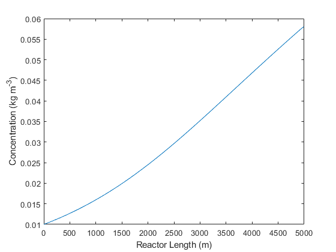

# Microalgae Growth Simulation
Due to increasing fossil fuel demands there is a need to find sustainable energy sources as a replacement. Lipids could be extracted from microalgae to produce biodiesel.

In this project, microalgae growth was simulated in an annular photobioreactor using light as its main nutrient.

## Features:
- Plots a [concentration profile](#concentration-profile) (microalgae vs. reactor length)
- Plots for visualizing microalgae light attenuation characteristics
- Sensitivity analysis for the effects of geometry (size) on growth for 1891 configurations
- Plots to visualize light irradiance profile (irradiance vs. reactor length)
- Plots to visualize the maximum concentration attainable for a given reactor geometry
- Plots to compare the average light irradiance of the annular photobioreactor vs. a more "traditional design"

### Concentration Profile

## Demo

## References
[Mie theory code](http://scatterlib.wikidot.com/mie) by Krzszystof Markowicz home page at IGf UW
