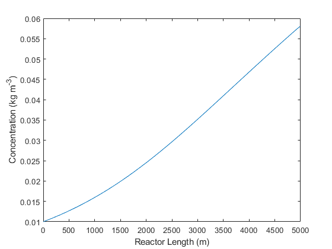

# Microalgae Growth Simulation
Due to increasing fossil fuel demands there is a need to find sustainable energy sources as a replacement. Lipids could be extracted from microalgae to produce biodiesel.

In this project, microalgae growth was simulated in an annular photobioreactor using light as its main nutrient.

## Features:
- Plots a concentration profile (microalgae vs. reactor length)

### Demo

## References
[Mie theory code](http://scatterlib.wikidot.com/mie) by Krzszystof Markowicz home page at IGf UW
