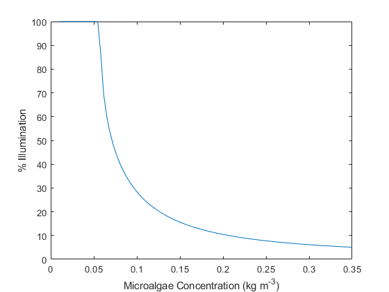
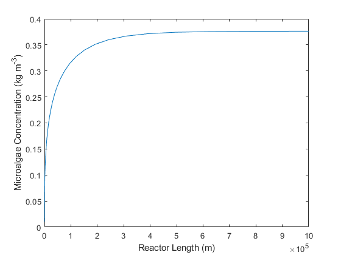
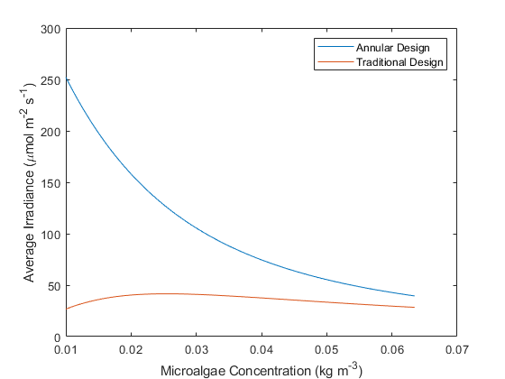

# Microalgae Growth Simulation
Due to increasing fossil fuel demands there is a need to find sustainable energy sources as replacements. Lipids could be extracted from microalgae to produce biodiesel.

In this project, microalgae growth was simulated in an annular photobioreactor using light as its main nutrient.

## Features:
- Plots a [concentration profile](#concentration-profile) (microalgae vs. reactor length)
- Plots for visualizing microalgae [light attenuation characteristics](#microalgae-light-attenuation-characteristics)
- Sensitivity analysis for the effects of geometry (size) on growth for 1891 configurations
- Plots to visualize [light irradiance profile](#light-performance) (irradiance vs. concentration)
- Plots to visualize the [maximum concentration](#maximum-concentration) attainable for a given reactor geometry
- Plots to [compare designs](#design-comparison) between the average light irradiance of the annular photobioreactor vs. a more "traditional design"

### Concentration Profile

From the figure above, the concentration of *Neochloris oleoabundans* (a strain of microalgae) grows from 0.01 kg/cum to roughly 0.058 kg/cum on a dry-mass basis. The length of the reactor is 5 km long.

### Microalgae Light Attenuation Characteristics

The above figure shows the relationship between absorption and scattering efficiencies against wavelength of light. `mie.m` determines the absorption and scattering fractions as per [(Pottier et. al. 2005)](https://onlinelibrary.wiley.com/doi/abs/10.1002/bit.20475).

This figure shows the relationship of backscatter fraction against wavelength of light.

These two plots could be validated against literature for accuracy. Currently, this data has not been published in literature for *N. oleoabundans*, so these results were not validated.

### Light Performance

As microalgae absorbs and scatter light, the more microalgae there is in the system, the less irradiated the reactor is. The plot was created for a fixed reactor geometry.

### Maximum Concentration

For a given geometry, there is a maximum attainable concentration. This figure also indicates at which point adding more length to the reactor is not efficient.

### Design Comparison

## Demo

## References
[Mie theory code](http://scatterlib.wikidot.com/mie) by Krzszystof Markowicz home page at IGf UW
